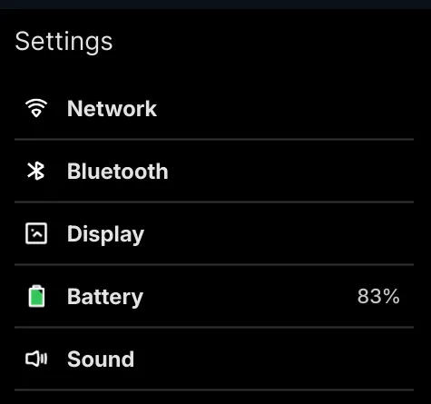
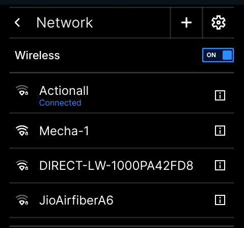
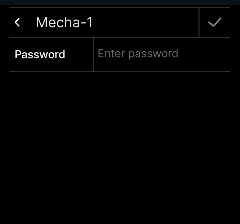
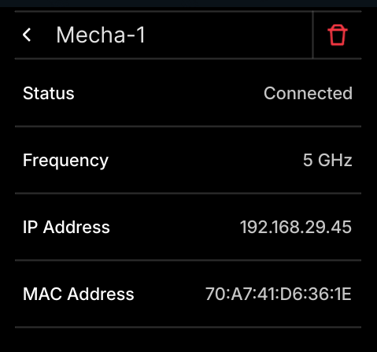

### Connect a Wireless Network from Settings App

The Mecha Comet  has built in Wireless and Bluetooth support.
To connect the Mecha Comet  to your wireless network, you can use the Settings App available on the Home Screen and follow these steps:

1. Launch the Settings App available on the Home screen.
2. Navigate to **Network → Enable Wireless (toggle)**
3. Find your Wireless Network and enter your password to get connected or you can add hidden network from Add network option by clicking on the icon **( + )** \


\




### Connect to Wireless from terminal

1. Check available Wireless networks:
```
nmcli dev wifi list
```
2. Connect to a Wireless Network:
Replace `<SSID>` with the network’s name & `<password>` with the network’s password
```
nmcli dev wifi connect `<SSID>` password `<password>`
```
For example, 
```
nmcli dev wifi connect "MyHomeWiFi" password "mywifipassword"
```
3. Check the Connection Status:
```
nmcli dev status
```
