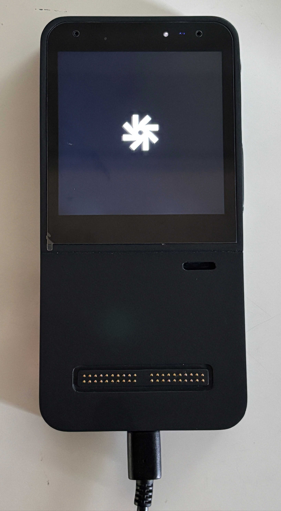

import Tabs from "@theme/Tabs";
import TabItem from "@theme/TabItem";
import S from "@site/components/Steps/";

<S.Column>
  The Mecha Comet-M device is an open-source handheld computer with focus on
  multimedia and extension abilities that enables you to build applications on
  the edge and much more. Navigate through this quick tutorial to get up and
  running with your Comet-M.
</S.Column>

<S>
    <S.Step>
        <S.Details>
            ### Connecting to the Power Supply

            You can use any regular Type-C or USB based power supply for the Comet-M that you have lying around.

            The recommended power supply for the Comet-M is a 5V, 2.5A (12.5W). Plug the type-C from your charger to the base Type-C port found at the bottom of the device.

            Once the power supply is connected you should see a white LED above the screen lit up.

            
        </S.Details>
    </S.Step>

    <S.Step>
        <S.Details>
            ### Turning the device on

           Use the Power button on the side of the device to turn it on, you may have to press it for a short second till a green LED above the screen lightens up.

           You will see the Mecha logo on the screen and the device will start booting up its operating system.

        </S.Details>
    </S.Step>

    <S.Step>
        <S.Details>
            ### Connecting to the Internet
            #### Connect a Wireless Network
            The Comet-M has built in Wireless and Bluetooth support.
            To connect the Comet-M to your wireless network, you can use the Settings App available on the Home Screen and:

            1. Launch the Settings App available on the Home screen
            2. Navigate to **Network → Enable Wireless (toggle)**
            3. Find your Wireless Network and enter your password to get connected or you can add hidden network from Add network option by clicking on the icon **( + )**
        </S.Details>
    </S.Step>

</S>
