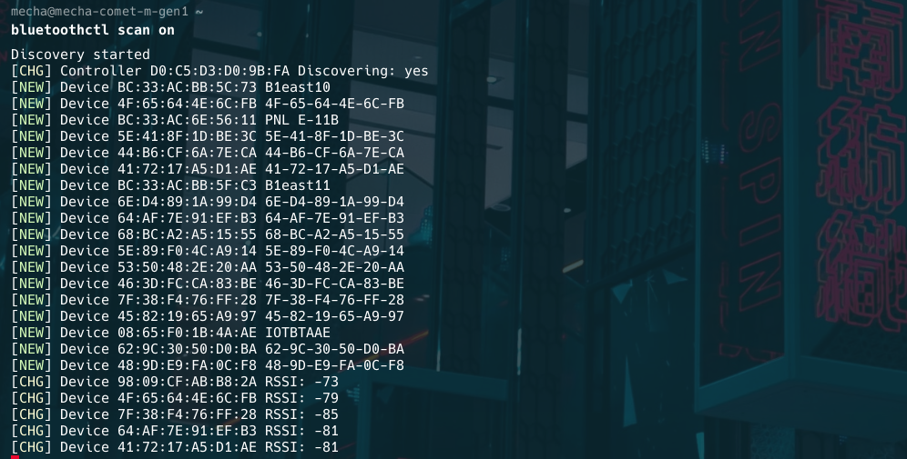

### 1. Checking Bluetooth Status
Before you can add Bluetooth devices, the Bluetooth service on your computer must be up and running. You can check it with the help of the systemctl command.

```
sudo systemctl status bluetooth
```


If the Bluetooth service status is not active you will have to enable it first. Then start the service so it launches automatically whenever you boot your computer.

```
sudo systemctl enable bluetooth
sudo systemctl start bluetooth
```

### 2. Scanning for Nearby Devices
To actively search for Bluetooth devices that you can connect to, use the scan command as follows:

```
bluetoothctl scan on
```




Note: If you can't find the Bluetooth device you are looking for, make sure that your system Bluetooth is discoverable.

To make your Bluetooth adaptor discoverable to other devices, use the following command:

```
bluetoothctl discoverable on
```


You can also list devices that are within the Bluetooth range of your computer using the command below:

```
bluetoothctl devices
```


### 3. Connecting to Your Device
Now that you have a list of Bluetooth devices you can connect to, use the MAC address to connect to a particular device.

The simplest way to connect with a Bluetooth device is to pair it with your PC using the pair command.

```
bluetoothctl pair 90:A8:22:8E:A7:7D
```

Note: Remember to replace the MAC address 90:A8:22:8E:A7:7D used in this guide with the respective MAC address of your device.

### 4. Trusting Paired Devices
In addition to pairing with a Bluetooth device, you can also choose to trust certain devices so that you easily connect to them in the future.

To trust a Bluetooth device:

```
bluetoothctl trust 90:A8:22:8E:A7:7D
```

You can untrust a device by issuing the following command:

```
bluetoothctl untrust 90:A8:22:8E:A7:7D
```

### 5. Connect to a Device
```
bluetoothctl connect [MAC address]
```

### 6. Disconnect from a Device
```
bluetoothctl disconnect [MAC address]
```

### 7. Remove a Paired Device
```
bluetoothctl remove [MAC address]
```

### 8. Get Device Info
```
bluetoothctl info [MAC address]
```


This guide should help you get started with using wifi and bluetooth devices on Mecha Device or any Debian based linux system.