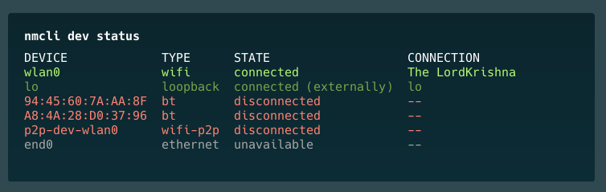
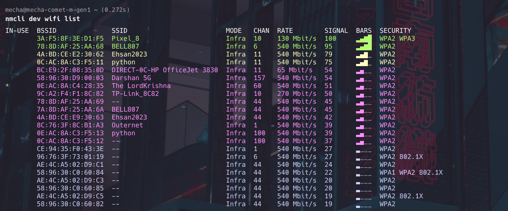

import S from "@site/components/Steps";

Connect to Wireless network on Mecha device

You're having Wireless that supports 2.5/5 ghz bandwidth

You're using nmcli to interact with network wifi device onboard

### 1. List Available Device Interfaces
To see all available Wireless networks:

```
nmcli device status
```



If you're not sure on status of your wifi device

To get status of wifi device:

```
nmcli radio wifi
```

To turn Wireless on:

```
nmcli radio wifi on
```

To turn Wireless off:

```
nmcli radio wifi off
```

### 2. List Available Wireless Networks
To see all available Wireless networks:

```
nmcli device wifi list
```



### 3. Connect to a Wireless Network (may require sudo)
To connect to a Wireless network:

```
nmcli device wifi connect SSID-Name password wireless-password
```

Replace "SSID-Name" with the network name and "wireless-password" with the actual password.

Alternatively, if you don't want to write out your password onscreen, you can use the --ask option:

```
nmcli --ask dev wifi connect network-ssid
```

### 4. Connect to a Hidden Wireless Network
For hidden networks:

```
nmcli device wifi connect SSID-Name password wireless-password hidden yes
```

### 5. Disconnect from Wireless
To disconnect the current Wireless connection:

```
nmcli device disconnect wlan0
```

Replace "wlan0" with your wireless interface name if different.

### 6. Show Saved Connections
To list all saved connections:

```
nmcli connection show
```

### 7. Connect to a Saved Network
To connect to a previously saved network:

```
nmcli connection up id NetworkName
```

### 8. Forget a Saved Network
To remove a saved network:

```
nmcli connection delete id NetworkName
```

### 9. Get Details of Current Connection
To see details of the active connection, including password:

```
nmcli device wifi show-password
```

### 10. Modify a Connection
To change the password of a saved network:

```
nmcli connection modify id NetworkName wifi-sec.psk "new-password"
```

### 11. Create a New Connection Without Connecting
To add a new connection without immediately connecting:

```
nmcli connection add type wifi con-name "ConnectionName" ifname wlan0 ssid "SSID-Name"
nmcli connection modify "ConnectionName" wifi-sec.key-mgmt wpa-psk wifi-sec.psk "password"
```

### 12. Scan for New Networks
To refresh the list of available networks:

```
nmcli device wifi rescan
```