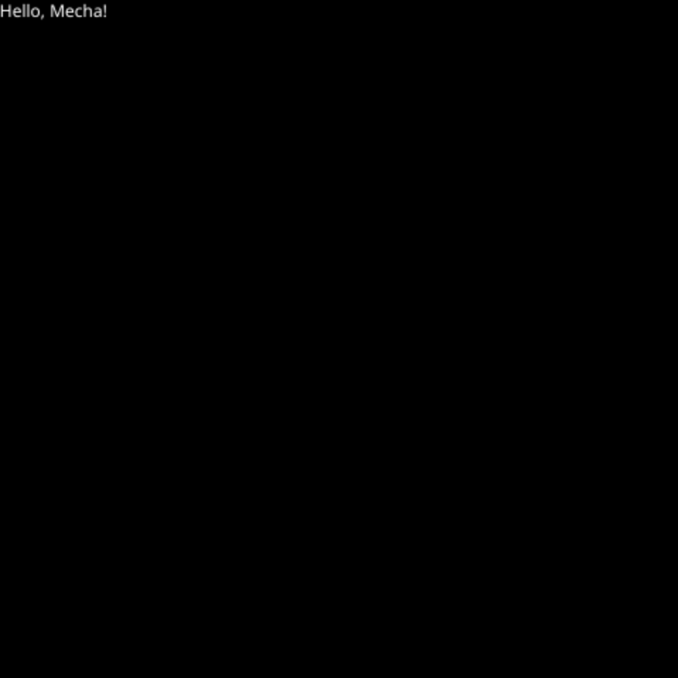

Let's create our first mctk application. In this tutorial, we are going to understand the structure of a basic mctk application while writing a simple application that displays simple text on the screen.

**Note:** We are assuming that you have read the setup section.

## Creating a new app

Let's create a new Rust app using Cargo.

```bash
cargo new --bin hello-world-mctk
```

This command will create a new folder named "hello-world-mctk". There will be two important files in that folder: `src/main.rs` and `Cargo.toml`.

## Adding Dependencies

Add the following code under the `[dependencies]` section of your `Cargo.toml`.

```toml
[dependencies]
mctk_core = { git="https://github.com/mecha-org/mctk", rev="3271214792f3b4f9ee149b7215b79cb9ff55849b" }
mctk_smithay = { git="https://github.com/mecha-org/mctk", rev="3271214792f3b4f9ee149b7215b79cb9ff55849b" }
mctk_macros = { git="https://github.com/mecha-org/mctk", rev="3271214792f3b4f9ee149b7215b79cb9ff55849b" }
```
**Note:** You can use the latest version of mctk by changing `rev="..."` to `branch="dev"`, but doing this might result in errors as mctk is under rapid development and is subject to change.

## Creating a Window

First, we have to create two structs: `AppParams` and `App`.

```rust
use mctk_core::prelude::*;

#[derive(Clone)]
struct AppParams;

#[derive(Clone, Default, Debug)]
struct App;
impl Component for App {}
impl RootComponent<AppParams> for App {
    fn root(&mut self, _window: &dyn std::any::Any, _app_params: &dyn std::any::Any) {}
}
```

`App` has implemented two traits: `Component` and `RootComponent<AppParams>`. Components are the building blocks of an mctk application, as they provide information about the layout, functionality, and state of each element.

`trait RootComponent<T>` needs the implementation `fn root(&mut self, window: &dyn std::any::Any, params: &dyn std::any::Any);`. This function is going to be called during initialization.

`AppParams` is going to be passed during the creation of the application, which can be accessed in the `fn root(..)` function.

In the main function, we need two variables to configure the window.

```rust
use mctk_smithay::{
    xdg_shell::xdg_window::{XdgWindow, XdgWindowParams},
    WindowInfo, WindowOptions,
};

fn main() {
    let window_opts = WindowOptions {
        height: 480,
        width: 480,
        scale_factor: 1.0,
    };
    let window_info = WindowInfo::default();
    // ...
}
```

`WindowOptions` is used to set the resolution of the window, and `WindowInfo` is used to set other parameters like title, ID, and namespace.

Finally, we call `XdgWindow::open_blocking` to open the window.

```rust
use mctk_smithay::{
    xdg_shell::xdg_window::{XdgWindow, XdgWindowParams},
    WindowInfo, WindowOptions,
};

fn main() {
    // ...
    let _ = XdgWindow::open_blocking::<App, AppParams>(
        XdgWindowParams {
            window_info,
            window_opts,
            ..Default::default()
        },
        AppParams,
    );
    loop {}
}
```

`XdgWindow::open_blocking` takes two parameters: `XdgWindowParams`, which can be used to configure the window and set up static assets, and `AppParams`, which is going to be passed into the `fn root(..)` function when the root component is being initialized.

We are adding `loop {}` at the end to prevent the application from closing instantly.

## Running the Application

Make sure you have Sway running. You can run it with the following command:

```bash
sway &
```

Set the environment variable `WAYLAND_DISPLAY=wayland-1`:

```bash
export WAYLAND_DISPLAY=wayland-1
```

Then run the command:

```bash
cargo run
```

**If the application compiles and runs successfully, you have done everything correctly. Nothing will be displayed on Sway as we haven't added any components.**

## Adding Components to our App

`trait Component` has a `fn view(&self) -> Option<Node>` function that optionally returns a `Node`. You can interpret `Node` as an instance of a Component which is going to have the styles and layout.

Let's add a div and simple text to our app.

```rust
impl Component for App {
    fn view(&self) -> Option<Node> {
        let mut base = node!(Div::new().bg(Color::BLACK), lay![size_pct: [100]]);
        base = base.push(node!(
            Text::new(txt!("Hello, Mecha!")).style("color", Color::WHITE)
        ));
        Some(base)
    }
}
```

After running the app, you should see a window with a black background and text saying "Hello, Mecha!" as shown in the image below.



**Congratulations, you have built your first mctk application!**
