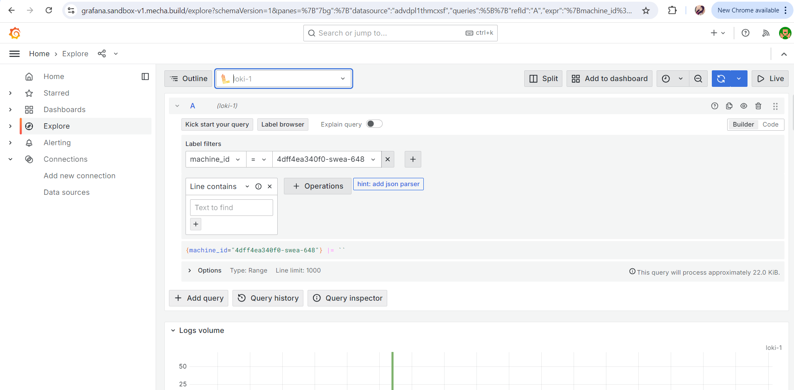
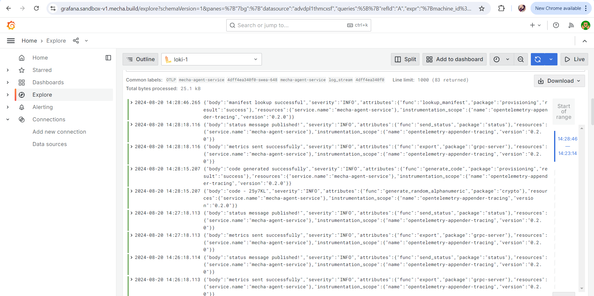

# Query Logs On Grafana

## Step 1: Log In to Your Mecha Console

- Start by logging into your Mecha Console using your credentials.

## Step 2: Navigate to the Machines Section

- From the top menu, click on **Machines** to access the list of machines.
- Alternatively, if the machine is listed on the Console home, you can select it directly from there.

## Step 3: Select the Machine

- Choose the machine for which you want to check the metrics.
- After selecting the machine, go to the **Logs** section.

## Step 4: Explore Logs in Grafana

- In the **Logs** section, click on the **Explore** button.
- This action will automatically open the Grafana service without requiring additional authentication.
- Ensure that the selected data source is **Loki**.

## Step 5: Apply Relevant Filters

- In label filters, select `machine_id` for viewing logs.
- You can also select the machine and filter logs according to `machine-alias`.

## Step 6: Set the Time Range

- Choose the time range you want to query logs for. This helps in narrowing down to specific events within a given period.

## Step 7: View and Analyze Logs

- The logs will be displayed in real-time, allowing you to monitor the machine’s activities and diagnose issues.
- Use the available options to further refine your queries or add new ones for deeper analysis.

## Step 8: Download Logs

- If needed, you can download the logs by clicking on the **Download** button, allowing you to save them for further analysis or record-keeping.

**Screenshot Reference:**

