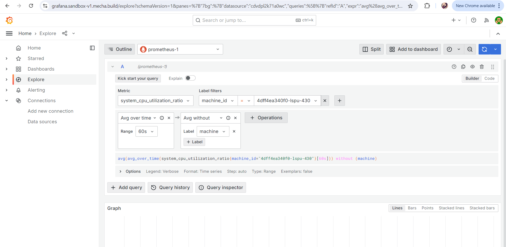

# Query Metrics On Grafana

To query metrics on Grafana using the Explore feature, follow these steps:

## Navigate to Explore:

- In the Grafana interface, go to the **Explore** section from the side menu.

## Select the Data Source:

- Choose **Prometheus** as your data source from the dropdown menu.

## Select Metrics:

- In the **Metrics** filter, select the desired metrics you wish to query.

## Filter by Machine ID:

- Use the label filters to select the `machine_id` that you want to focus on.

## Build the Query:

- Construct your query using the available options and syntax as shown in the interface. The query will allow you to retrieve and analyze the specific metrics related to the selected machine.
- Once your query is built, Grafana will display the results in real-time, allowing you to visualize and explore the metrics data effectively.

For detailed visuals and examples, refer to the screenshot below.

**Metrics on Grafana**
