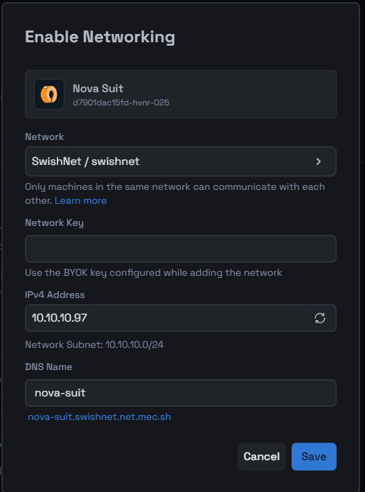

# BYOK with Networking

## Seamless Integration: Bringing Your Own Key (BYOK) with Networking

### Benefits of BYOK Networking Over Third-Party Managed Networks

- **Enhanced Security and Privacy Control**:
  With BYOK, you retain full control over your encryption keys, reducing the risk of unauthorized access or data breaches by third parties. Unlike third-party managed networks where key management is outsourced, BYOK ensures that only you and authorized parties have access to your data.

- **Regulatory Compliance**:
  BYOK helps you comply with stringent regulatory requirements and industry standards that mandate data control and protection. It enables you to demonstrate that you have sole control over encryption keys, which is often a requirement in sectors like finance, healthcare, and government.

- **Greater Transparency**:
  Using your own keys allows for complete transparency regarding who has access to your data and when. You are not dependent on a third party’s security practices, audits, or disclosures. This minimizes the trust needed in external parties, giving you more confidence in your network's security posture.

- **Flexibility and Customization**:
  BYOK allows for greater flexibility in configuring your network security to meet your specific needs. You can choose the key rotation schedules, encryption algorithms, and other security parameters that best fit your organization’s policies and risk profile.

- **Minimized Risk of Vendor Lock-in**:
  By managing your own keys, you maintain the freedom to switch service providers or migrate data without being tied to a specific third-party vendor's key management system. This ensures you are not locked into a particular platform or service due to proprietary encryption methods.

- **Immediate Key Revocation**:
  In the event of a security breach or suspected compromise, you have the ability to immediately revoke or rotate your encryption keys. This rapid response capability reduces the window of exposure and enhances overall network security.

- **Cost Efficiency**:
  While third-party managed key services may come with additional costs, BYOK can potentially reduce expenses related to key management, especially if your organization already has an in-house team or tools for key management.

Adding security and connectivity to your machine is crucial. Here’s how to integrate your own encryption key with networking on Mecha.

### Prerequisite:

Before you start, confirm that your account has at least one network ready to be used. You’ll usually find a ‘Default’ network pre-set in your account, but you can customize or create a new network if needed.

### Step 1: Begin the Network Setup for BYOK

You can start setting up the network for your machine in two ways:

- **Through Machine Listing**:
  Locate your machine and click ‘Enable’ under the IP address section.

- **Through Machine Details**:
  Navigate to **Settings > Networking** within the machine details page, and click ‘Enable’ to begin.

### Step 2: Configure Networking with Your Key

A configuration modal will appear to help you set up the network:

- **Select the Network**:
  Choose the appropriate network from the dropdown list. In this example, "SwishNet / swishnet" is selected.

- **Enter the Network Key**:
  Use the BYOK (Bring Your Own Key) key that you configured while adding the network.

- **Input the IPv4 Address**:
  Use the suggested address (e.g., 10.10.10.97), regenerate a new one, or enter a custom address within the network's subnet (e.g., 10.10.10.0/24).

- **Specify the DNS Name**:
  Use the given DNS name or enter your preferred one (e.g., nova-suit).

After entering these details, click **Save** to finalize the settings.

### Step 3: Verify Your Network and Key Integration

Make sure everything is configured properly:

- **Check the Machine Listing**:
  Verify that the IP address is now linked to your machine as configured.

- **Inspect Machine Details**:
  Go to **Settings > Networking** within the machine details page to confirm the network settings.

- **Review Network Details**:
  Ensure that the machine appears in the network nodes table under the selected network.

By following these steps, you’ve successfully integrated your machine with your custom encryption key into the network, adding an extra layer of security and connectivity.
