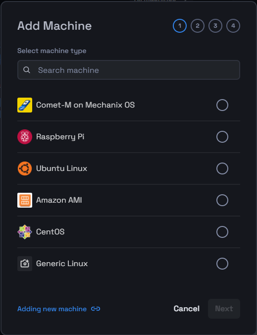
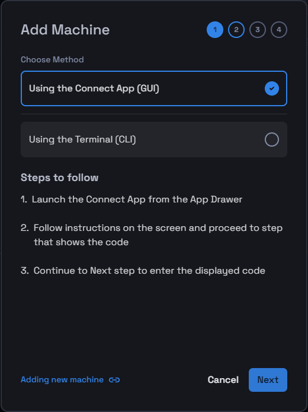
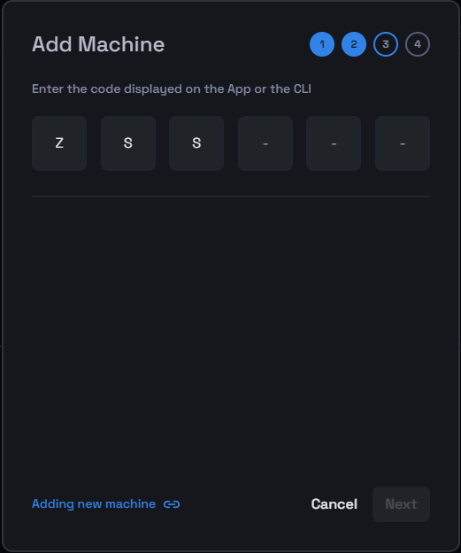
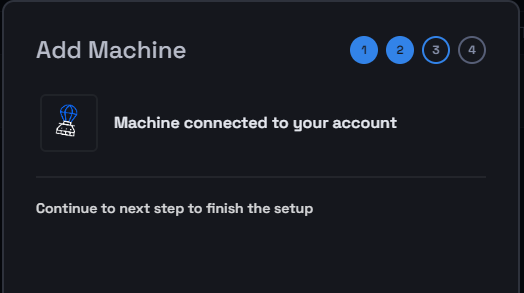
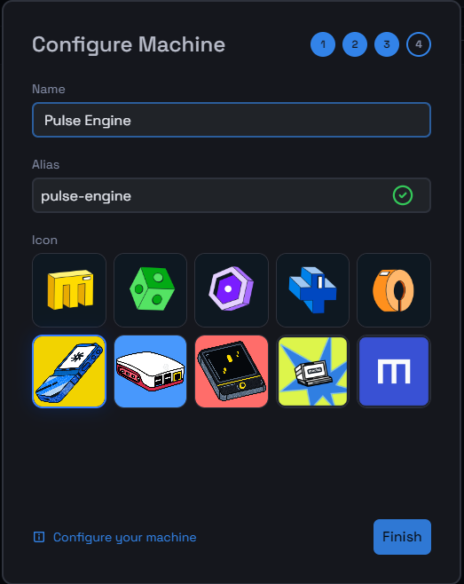
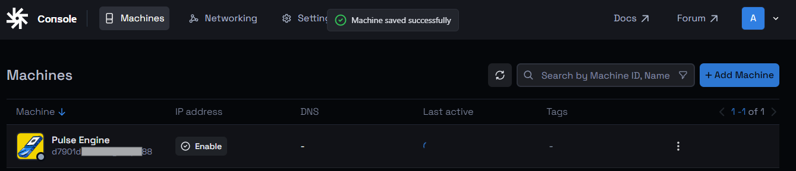

# Add Your First Machine to Mecha Cloud

In this guide, we'll walk you through the steps to add a new machine to Mecha Cloud.

## Log in to Mecha Cloud

1. **Access the Login Page**:
   Open your web browser and go to the Console login page https://console.sandbox-v1.mecha.build/auth/signin.
2. **Enter Your Credentials**:
   Provide your username and password, then click **Login**.
3. **Navigate to the Console**:
   After logging in, you'll be directed to the Console homepage.

## Steps to Add a Machine

1. **Initiate Add Machine:** You can either add a machine directly by clicking the '**New Machine'** button or proceed via the Machines section on the top menubar. Click the '**Add Machine'** button to begin the setup process.
2. **Select Machine Type**:
   Choose the machine type from the list or use the search function, then click **Next**.

3. Choose a method for generating provisioning code for adding the new machine. You may choose to opt either for using the Connect App (GUI) or via using the terminal (CLI).

4. **Get a Provisioning Code**:
   Select a method to obtain the provisioning code for the machine:
   * **Using the Connector App (GUI)**
   * **Using the Terminal (CLI)**
5. **Enter the Code**:
   Input the code displayed on the App or the CLI to proceed.

## Configure Machine Settings

1. **Complete the Setup**:
   Once the machine is connected to the Mecha Console, proceed to the next step to finalize the configuration.

2. **Customize Machine Details**:
   * **Name & Alias**: Enter a name and alias of your choice, or keep the suggested ones.
   * **Select an Icon**: Optionally, choose an icon for the machine or use the default one.

3. **Finish the Setup**:
   After configuring the settings, click **Finish** to complete the setup.

## Verify the Addition

1. **Check the Machines List**: Navigate back to the Machines section to ensure the new machine appears in the list and is correctly configured.

You are now all set to start using the new machine and begin operations.