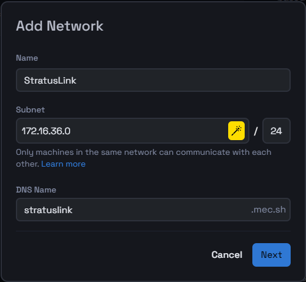

# Create a New Virtual Network

This tutorial will guide you through the process of adding a network in the Mecha Console, whether you choose to use a managed encryption key or provide your own.

### Step 1: Visit the Networking Page

#### 1. **Navigate to Networking:**
   * From the top main menu in the Mecha Console, select **Networking** to access the networking page.

### Step 2: Add a New Network

#### 1. **Click on Add Network:**
   * On the networking page, click **Add Network** to start the process of creating a new network.

#### 2. **Fill in the Network Details:**
   * **Name:** Enter a unique name for your network.
   * **Subnet:** You can either generate a subnet using the yellow icon or enter a custom subnet.
   * **DNS Name:** Specify the DNS name for the network.

After entering these details, click **Next** to proceed.

### Step 3: Set Encryption Method

#### 1. **Choose an Encryption Method:**
   * **Managed by Mecha:**
      * The encryption key is automatically generated and securely stored in an encrypted key store managed by Mecha.
   * **Bring Your Own Key (BYOK):**
      * You have the option to provide your own encryption key. This key is **not** stored in Mecha's storage.
      * **Enter or Generate a Key:** Specify an encryption key of 32 characters or generate one using the provided tool.
      * **Note:** You will need to re-enter this key every time you add a new node to this network.
    

#### 2. **Save the Network:**
   * Once you've configured the encryption method, click **Save**.
   * Your new network will be created, and you will be automatically redirected to its details page.

You've successfully added a new network to your Mecha Console. This network is now ready to be utilized by your devices and applications.