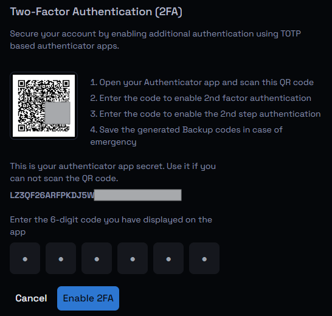

# Two-Factor Authentication (2FA) Setup Guide

Two-Factor Authentication (2FA) adds an extra layer of security to your accounts by requiring not just a password, but also a time-sensitive code generated by an authenticator app. This tutorial will guide you through the process of enabling 2FA using a Time-based One-Time Password (TOTP) authenticator app, which enhances the security of your accounts.

### Step 1: Install an Authenticator App

Before you begin, you need an authenticator app on your smartphone. Popular options include:

* **Google Authenticator** (iOS, Android)
* **Microsoft Authenticator** (iOS, Android)
* **Authy** (iOS, Android)
* **LastPass Authenticator** (iOS, Android)

Download and install one of these apps from your device's app store.

### Step 2: Access 2FA Settings on Your Account

1. **Login to your account**: Start by logging into the Mecha account for which you want to enable 2FA.
2. **Navigate to the Account Settings**: Find the Settings menu from the top navigation bar or Account option in User dropdown menu. Lookout for "Account" page under settings.
3. Scroll down to find the option to enable Two-Factor Authentication (2FA).

### Step 3: Initiate the 2FA Setup

1. Click on Enable 2FA: When you find the 2FA settings, click on 'Enable 2FA' button.
2. **QR Code Displayed**: A QR code will be displayed on the screen. This QR code contains the secret key that your authenticator app will use to generate the time-based codes.
3. **Alternative Secret Code**: Beneath the QR code, you will see a secret key, like the one shown below:

This key can be used if you cannot scan the QR code.

### Step 4: Set Up the Authenticator App

1. **Open the Authenticator App**: On your smartphone, open the authenticator app you installed earlier.
2. **Add a New Account**:
   * In the app, choose the option to add a new account.
   * You can typically do this by tapping the "+" icon or selecting "Set up account."
3. **Scan the QR Code**:
   * Use the app's QR code scanner to scan the QR code displayed on your account's setup screen.
   * If you are unable to scan the QR code, choose the option to enter the secret key manually, and type in the key displayed on the setup screen.
4. **Save the Backup Codes**:
   * After scanning, your app will start generating 6-digit codes that refresh every 30 seconds.

### Step 5: Complete the 2FA Setup

1. **Enter the 6-Digit Code**:
   * On the account setup page where you scanned the QR code, enter the 6-digit code displayed in your authenticator app.
   * This code is time-sensitive and will change every 30 seconds, so make sure to enter it promptly.
2. **Enable 2FA**:
   * After entering the code, click on the "Enable 2FA" button to finalize the process.
3. **Confirmation**:
   * You will receive a confirmation message indicating that Two-Factor Authentication has been successfully enabled on your account.

### Step 6: Secure Your Backup Codes

* **Store Backup Codes Safely**: If provided, store the backup codes securely. These can be used if you lose access to your authenticator app.

### Step 7: Test Your 2FA Setup

1. **Log Out and Log In**: Log out of your account and try logging back in.
2. **Enter 2FA Code**: After entering your password, you'll be prompted to enter a code from your authenticator app or backup code. Enter the code to complete the login process.

### Tips:

* **Multiple Devices**: If you have multiple devices, consider setting up the authenticator app on both for redundancy.
* **Regular Backups**: Regularly back up your authenticator codes and backup codes to prevent being locked out.

By following these steps, you'll have added a robust layer of security to your Mecha account, making it much more difficult for unauthorized users to gain access.