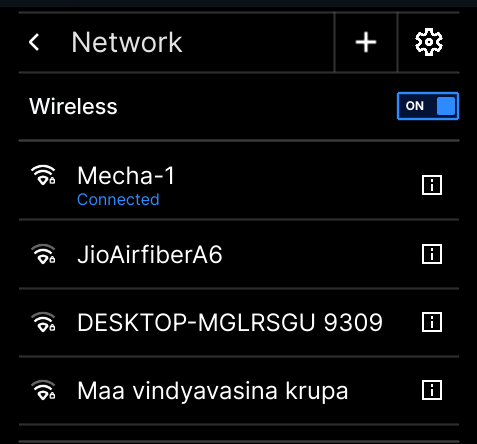
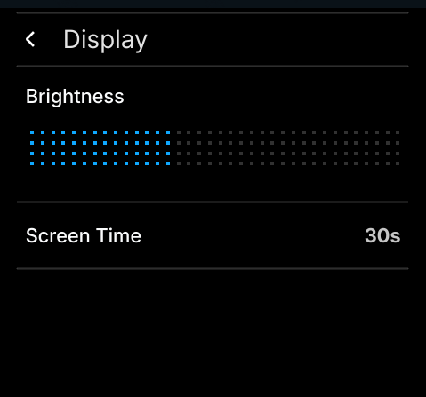
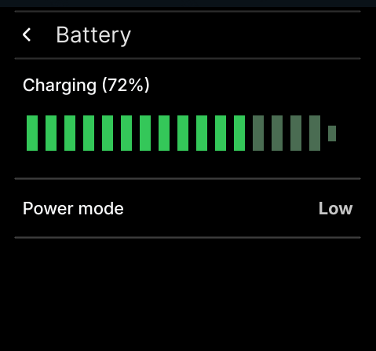
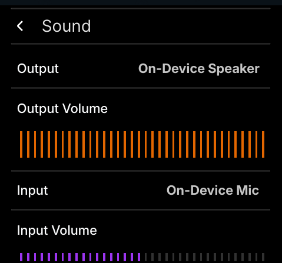

import Tabs from "@theme/Tabs";
import TabItem from "@theme/TabItem";
import S from "@site/components/Steps/";

<S.Column>
 The Settings App can be accessed through short cut from home screen as well as from the app-drawer. The Settings app is divided into several categories to help organize the various settings you can manage. 
</S.Column>

## Key Features

### 1. Network

The Network section allows you to manage your network connections.
You can connect to available wireless networks, manage saved Wi-Fi networks, or disconnect.

- **Turn Wireless On/Off**: Toggle Wireless functionality.
- **Available Networks:** Settings → Network , Find your Wireless Network and enter your password to get connected or you can add hidden network from Add network option by clicking on the icon  **(** **+ )**
- **Network Management**: View and manage previously paired networks, disconnect or forget.\

### 2. Bluetooth
The Bluetooth module allows you to manage and configure Bluetooth devices. Through this module, you can:

- **Turn Bluetooth On/Off**: Toggle Bluetooth functionality.
- **Pair Devices**: Scan for and connect to Bluetooth devices such as headphones, keyboards, and more.
- **Device Management**: View and manage previously paired devices, remove them, or reconnect.

### 3. Display

for adjusting the display settings of the device:

- **Adjust Brightness:**  Control the screen brightness to suit your environment and viewing preferences by scrolling the slider.
- **Set timeout:** Configure the screen timeout to automatically turn off the display after a period of inactivity, helping to save power. You can choose from various timeout duration or disable the screen timeout altogether by choosing Never option.\

### **4. Appearance**

Customize the look and feel of system software through the Appearance settings:

- **Set Wallpaper:** Personalize your system software’s background by selecting and setting custom wallpapers. You can choose from a variety of built-in wallpapers or use your own images.
- **Set Ambient mode:** Activate Ambient Mode to display a visually appealing; while the Ambient mode is on, the wallpaper will turn darker.

### **5. Battery**

Keep track of your device’s battery health and adjust power settings to extend battery life:

- **Battery Status**: View current battery percentage, charging status.
- **Power Mode**:
    - **High (Performance):** Ideal for demanding tasks like gaming or video editing, but uses battery   rapidly.
    - **Medium (Conservative):** A good balance for most everyday use, providing decent performance while managing battery life.
    - **Low (Power Saving):** Prioritizes maximum battery life by limiting performance, suitable for situations where you need your device to last as long as possible.\

### 6. Sound

This module allows you to control sound settings and manage audio devices:

- **Output Devices**: Select and configure your default sound output devices (speakers, headphones, etc.).
- **Input Devices**: Configure microphone and other input devices.\

### 7. Lock

Configure system’s locking behavior to secure your device when not in use:

- **Enable Lock:** Choose to apply lock or not.
- **Lock timeout:** Choose or configure a lock after a set period of inactivity.

### 8. Date & Time

To adjust device date and time settings:

- **Set Date & Time**: Manually adjust the system’s date and time, or allow it to sync automatically with a network time protocol (NTP) server.
- **Time Zone**: Set your system’s time zone or choose to have it automatically detect your location.
- **Clock Format**: Choose between 12-hour or 24-hour time formats, and adjust date formatting.

### 9. Language

To customize your system’s language and regional preferences:

- Change the system language to your preferred choice, supporting multiple languages

### 10. Update

Keep Mecha Comet software up-to-date with the latest security patches, bug fixes, and software updates:

- **Check for Updates**: Scan for available software updates, including OS patches, application updates, and firmware updates.
- **Automatic Updates**: Enable toggle

### 11. About

- View device information like Host name suffixed with **‘.local’** text
for example,"my-host-name.local” ;
- Other information are also included like:
Make/ Model, Wireless IP Address, Ethernet IP Address, Wireless MAC Address, Ethernet MAC Address, OS name, Kernel version.\
![Image]/(../../../src/images/about_device_screen.jpg)