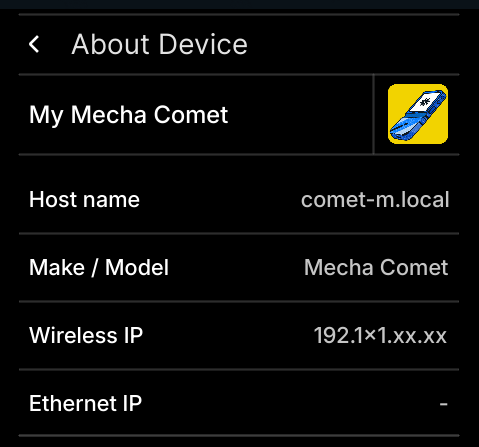

import Tabs from "@theme/Tabs";
import TabItem from "@theme/TabItem";
import S from "@site/components/Steps/";

# Settings App

The Settigns app provides access you to various configuration options for your Mecha Comet.

<S.Column>
You can access the Settings App in two ways :
1. From Home Screen: Tap the Settings app icon.
2. From App drawer:  Swipe up from bottom of the screen & tap on the Settings app icon
</S.Column>

## Key Features

### 1. Network
    To manage your network connections.

    #### Connecting to Known Wireless Network 
    1. Navigate to **Network > Enable Wireless (toggle)** 
    2. To connect your network, tap on your network & enter correct password 

    #### Connecting to Unknown Wireless Network 
    1. Tap on **(+)** icon
    2. To connect your network, enter correct natwork name & password, submit by pressing on submit icon

    #### View Saved networks
    1. Tap on **(*)** network settings icon;\
    you can forget saved network from here by taping  on trash icon besides saved network name

    #### View Network information
    1. Tap on information icon **(i)** beside network name listed in network list
    
    #### Forget a Network
    1. tap on info icon beside Network name
    2. tap on trash icon

### 2. Display
    To adjust the display settings of the device:

    **Adjust Brightness:**  Control the screen brightness to suit your environment and viewing preferences by scrolling the slider.
    

### 3. Battery
    Keep track of your device’s battery health and adjust power settings to extend battery life.\
    It shows current battery percentage, charging status.

    **Power Mode**:\
        **High :** Optimized for performance, resulting in faster battery usage.\
        **Medium :** A good balance for most everyday use, providing decent performance while managing battery life.\
        **Low :** Prioritizes maximum battery life by limiting performance, suitable for situations where you need your device to last as long as possible.\
    

### 4. Sound
    This module allows you to control sound settings and manage audio devices:

    **Output Devices**: Select and configure your default sound output devices (speakers, headphones, etc.).
    **Input Devices**: Configure microphone and other input devices.
     
    

### 5. About

    View device information:
    Host name suffixed with **‘.local’** text\
      &nbsp; &nbsp;  for example, **"my-host-name.local”,**\
    Make/ Model, \
    Wireless IP Address, \
    Ethernet IP Address, \
    Wireless MAC Address, \
    Ethernet MAC Address, \
    OS name, \
    Kernel version.\
        